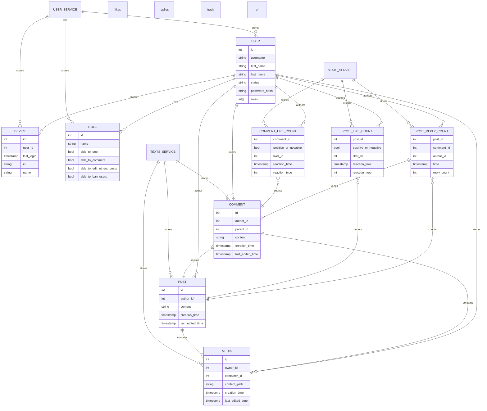

# Диаграмма Entity Relationship

```mermaid
erDiagram
    USER_SERVICE ||--o{ USER: stores
    USER_SERVICE ||--o{ DEVICE: stores
    USER_SERVICE ||--o{ ROLE: stores
    USER ||--o{ ROLE: has
    USER ||--|{ DEVICE: owns
    USER {
        int id
        string username
        string first_name
        string last_name
        string status
        string password_hash
        int[] roles
    }
    DEVICE {
        int id
        int user_id
        timestamp last_login
        string ip
        string name
    }
    ROLE {
        int id
        string name
        bool able_to_post
        bool able_to_comment
        bool able_to_edit_others_posts
        bool able_to_ban_users
    }
    TEXTS_SERVICE ||--o{ POST: stores
    TEXTS_SERVICE ||--o{ COMMENT: stores
    TEXTS_SERVICE ||--o{ MEDIA: stores
    COMMENT }o--|| POST: replies
    POST ||--o{ MEDIA: contains
    COMMENT ||--o{ MEDIA: contains
    USER ||--o{ POST: author
    USER ||--o{ COMMENT: author
    USER ||--o{ MEDIA: owner
    POST {
        int id
        int author_id
        string content
        timestamp creation_time
        timestamp last_edited_time
    }
    COMMENT {
        int id
        int author_id
        int parent_id
        string content
        timestamp creation_time
        timestamp last_edited_time
    }
    MEDIA {
        int id
        int owner_id
        int container_id
        string content_path
        timestamp creation_time
        timestamp last_edited_time
    }
    STATS_SERVICE ||--o{ POST_LIKE_COUNT: stores
    STATS_SERVICE ||--o{ COMMENT_LIKE_COUNT: stores
    STATS_SERVICE ||--o{ POST_REPLY_COUNT: stores
    POST_LIKE_COUNT }o--|| POST: counts likes
    COMMENT_LIKE_COUNT }o--|| COMMENT: counts likes
    POST_REPLY_COUNT }o--|| POST: counts replies
    POST_REPLY_COUNT ||--|{ COMMENT: keeps track of
    USER ||--o{ POST_LIKE_COUNT: authors
    USER ||--o{ COMMENT_LIKE_COUNT: authors
    USER ||--o{ POST_REPLY_COUNT: authors
    POST_LIKE_COUNT {
        int post_id
        bool positive_or_negative
        int liker_id
        timestamp reaction_time
        int reaction_type
    }
    COMMENT_LIKE_COUNT {
        int comment_id
        bool positive_or_negative
        int liker_id
        timestamp reaction_time
        int reaction_type
    }
    POST_REPLY_COUNT {
        int post_id
        int comment_id
        int author_id
        timestamp time
        int reply_count
    }
```
